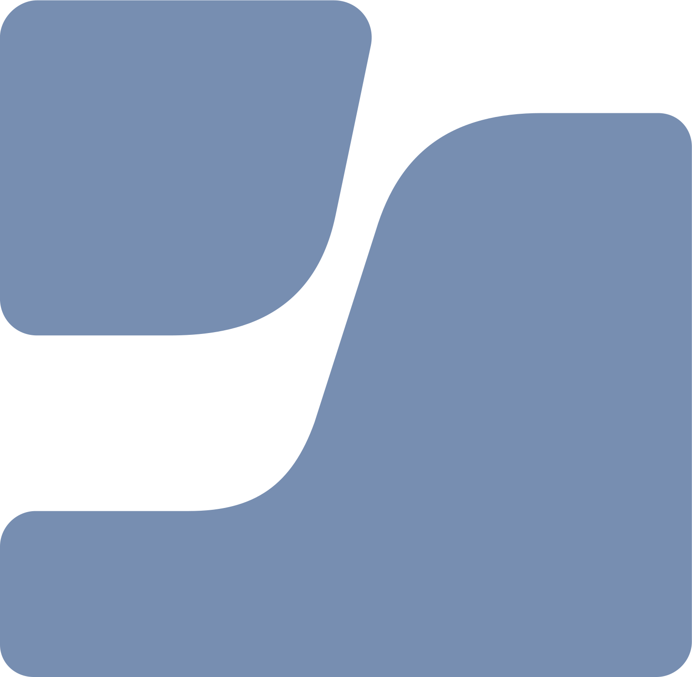

### Hey! My name is Jono! Thanks for stopping by 😁

I'm currently working as an SCCM and Jamf administrator and living in Kobe, preparing to begin my Masters of machine learning in Japan 🏯

I'm English-Japanese bilingual. 

If you're in Japan and want to get in touch, send me an email!

### Projects

I'm currently working on building some iOS applications that implement OpenAI.

### Languages and Tools:

<!--
**jonoswift7/jonoswift7** is a ✨ _special_ ✨ repository because its `README.md` (this file) appears on your GitHub profile.

Here are some ideas to get you started:

- 🔭 I’m currently working on ...
- 🌱 I’m currently learning ...
- 👯 I’m looking to collaborate on ...
- 🤔 I’m looking for help with ...
- 💬 Ask me about ...
- 📫 How to reach me: ...
- 😄 Pronouns: ...
- ⚡ Fun fact: ...
-->
